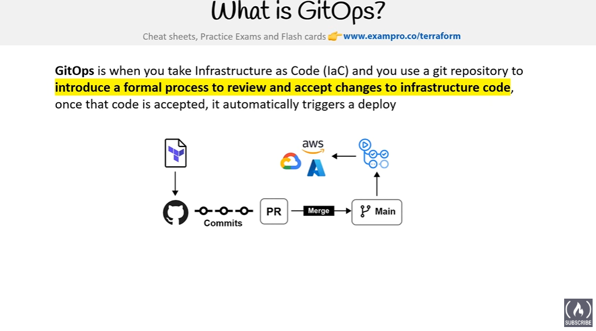

# terraform_associate
terraform associate certification - Mind map

✅ Terraform Associate (003) -- Final Revision Cheat Sheet

OPEN BOOK : www.terraform-best-practices.com

1\. Core Terraform Concepts

IaC (Infrastructure as Code): Declarative approach using .tf files.

Provider: Plugin for a specific cloud/service (e.g., AWS, Azure, GCP).

Resource: Actual infrastructure component (e.g., aws_instance).

Data Source: Fetch existing information (e.g., data "aws_ami" ...).

State File (terraform.tfstate):

Tracks current infra state.

Never edit manually unless necessary.

Store remotely for teams (e.g., S3 + DynamoDB).

Backend: Where state is stored (local or remote).

Module: Reusable set of .tf files (root module is your main directory).

2\. Workflow & Lifecycle

Standard Workflow:

terraform init → Initialize backend, providers.

terraform validate → Check syntax.

terraform plan → Preview changes.

terraform apply → Apply changes.

terraform destroy → Destroy resources.

Refresh State:

terraform refresh (or terraform plan automatically refreshes).

Locking: Prevent simultaneous state changes in remote backends.

3\. State Management

Commands:

terraform state list → List resources in state.

terraform state show <resource> → Show details.

terraform state mv → Move resource in state.

terraform state rm → Remove from state.

Best Practices:

Enable remote state for teams.

Use state locking.

Encrypt state.

4\. Variables & Outputs

Variable Types:

string, number, bool, list, map, object, tuple.

Ways to Define:

.tfvars files.

-var CLI option.

Environment variables (TF_VAR_<name>).

Precedence:

CLI > Environment > .tfvars > defaults.

Outputs:

output "name" { value = resource.attribute }

5\. Expressions & Functions

Interpolation:

"${var.name}" or directly var.name (0.12+).

Conditionals:

condition ? true_val : false_val

Common Functions:

length(), file(), lookup(), element(), concat().

toset(), tolist(), join(), split().

6\. Providers & Provisioners

Provider Block:

provider "aws" {

region = "us-east-1"

}

Provisioners:

local-exec → Execute locally.

remote-exec → SSH into instance.

Warning:

Provisioners = last resort, avoid them if possible.

7\. Modules

Structure:

main.tf, variables.tf, outputs.tf

Calling a Module:

module "vpc" {

source = "./modules/vpc"

cidr = "10.0.0.0/16"

}

Sources:

Local path, Git, Terraform Registry.

8\. Remote State & Workspaces

Remote State Backends:

S3, GCS, Azure Blob, Terraform Cloud.

Workspaces:

Separate state files for environments.

Commands:

terraform workspace new dev

terraform workspace select prod

terraform workspace list

Use Case:

Multi-environment management.

9\. Terraform Cloud & Enterprise

Features:

Remote state storage.

Remote execution.

Team access controls.

Sentinel (policy as code).

10\. Security & Sensitive Data

Mark variables as sensitive:

variable "password" {

type = string

sensitive = true

}

Avoid committing .tfstate or .tfvars with secrets.

Use Vault or environment variables for secrets.

11\. Dependency Graph & Ordering

Terraform uses implicit dependencies via references.

If explicit needed:

depends_on = [resource.example].

12\. Import & Drift

Import existing resources:

terraform import resource.name id

Drift: State vs real infra mismatch → use terraform plan.

13\. Commands Recap

terraform fmt → Format code.

terraform validate → Validate syntax.

terraform graph → Generate dependency graph.

terraform show → Show current state.

terraform taint → Mark resource for recreation.

terraform apply -auto-approve → Skip prompt.

14\. Exam Key Points

Understand state, workspaces, modules deeply.

Know how to authenticate providers.

No deep coding, but syntax & logic matter.

Expect Terraform Cloud, remote backends, and basic Sentinel concepts.

-help to have the help on a command - Example "terraform apply -help"

Sentinel – Terraform Associate (003) Cheat Sheet
1️⃣ Qu’est-ce que Sentinel ?

Moteur de “policy as code” développé par HashiCorp.

Permet de définir et appliquer des règles de sécurité, conformité et bonnes pratiques.

Intégré uniquement dans Terraform Cloud / Enterprise (pas dans Terraform OSS).

2️⃣ Pourquoi l’utiliser ?

Empêcher des déploiements non conformes :

VM trop grosses

Tags obligatoires manquants

Ressources sensibles non chiffrées

Ajouter une couche de gouvernance et contrôle automatisé dans le workflow Terraform.

3️⃣ Quand s’exécute Sentinel ?

Pendant le terraform plan, avant l’apply.

Il valide le plan et peut bloquer le déploiement si une règle est violée.

4️⃣ Ce que l’examen peut demander

Concepts : rôle de Sentinel, différence avec Terraform OSS.

Workflow : quand il agit dans Terraform Cloud / Enterprise.

Comparaison avec OPA : Sentinel = intégré HashiCorp, OPA = open-source et multi-plateformes.

Règles possibles : tags obligatoires, tailles de VM interdites, règles de sécurité.

5️⃣ Ce qu’il ne faut pas savoir pour l’examen

Tu n’as pas besoin d’écrire du code Sentinel.

Pas besoin de connaître le DSL en détail.

✅ Astuce pratique

Retiens juste :

Sentinel = contrôle automatique des plans Terraform dans Cloud/Enterprise avant apply.

Tout le reste = Terraform Cloud / Enterprise concepts + sécurité/conformité.

--

Questions -

Cloud init or packer ? (voir image)

refresh only mode - Pas compris l'exemple ou dû moins pas sûr à 100%